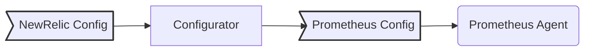

<a href="https://opensource.newrelic.com/oss-category/#community-project"><picture><source media="(prefers-color-scheme: dark)" srcset="https://github.com/newrelic/opensource-website/raw/main/src/images/categories/dark/Community_Project.png"><source media="(prefers-color-scheme: light)" srcset="https://github.com/newrelic/opensource-website/raw/main/src/images/categories/Community_Project.png"></picture></a>

# New Relic Prometheus Configurator

New Relic Prometheus Configurator (a.k.a. New Relic Prometheus Agent) gives you full observability of your services exposing [Prometheus](https://github.com/prometheus/prometheus) metrics.

This repo contains the code base of the `newrelic-prometheus-configurator` and the [Helm Chart](/charts/newrelic-prometheus-agent/README.md) to install the solution in Kubernetes.

The `newrelic-prometheus-configurator` uses a custom configuration that simplifies the experience related to configure features like discovery, filtering, metrics decoration, and sharding.



The `Configurator` generates a configuration file that is used to run a [Prometheus Server](https://github.com/prometheus/prometheus) in Agent mode, and send metrics to the New Relic Remote Write Endpoint.

## Installation

### Helm chart

You can install this chart using [`nri-bundle`](https://github.com/newrelic/helm-charts/tree/master/charts/nri-bundle) located in the
[helm-charts repository](https://github.com/newrelic/helm-charts) or directly from this repository by adding this Helm repository:

```shell
helm repo add newrelic-prometheus https://newrelic.github.io/newrelic-prometheus-configurator
helm upgrade --install newrelic newrelic-prometheus/newrelic-prometheus-agent -f your-custom-values.yaml
```

For further information of the configuration needed for the chart just read the [chart's README](/charts/newrelic-prometheus-agent/README.md).

## Getting Started

The simplest way to start working with this project is to install the [Chart](/charts/newrelic-prometheus-agent/README.md) in your Kubernetes cluster.

All pods and endpoints with the `newrelic.io/scrape: true` annotation will be scraped by default.

Moreover, the solution will scrape as well all pods and endpoints with the `prometheus.io/scrape: true` annotations and
having one of the labels matching the integrations_filter configuration.

Notice that at any point you can turn off the integrations filters and scrape all pods and services annotated with
`prometheus.io/scrape: true` by setting `config.kubernetes.integrations_filter.integrations_filter: false` or turning
it off in any specific job.

### Usage

For further information check out [the official documentation](https://docs.newrelic.com/docs/infrastructure/prometheus-integrations/install-configure-prometheus-agent/install-prometheus-agent/)
and if you are migrating from nri-prometheus check the [migration guide](https://docs.newrelic.com/docs/infrastructure/prometheus-integrations/install-configure-prometheus-agent/migration-guide).

Dashboard:

You can import an already pre-constructed dashboard by importing the [dashboard.json](/assets/dashboard.json) file. Note that for the import to work you need to replace the json placeholder `ACCOUNT_ID_PLACEHOLDER` for your New Relic `accountID`. You can use the following command to do so:

```
sed -i '' 's/ACCOUNT_ID_PLACEHOLDER/accountID/g' assets/dashboard.json
```

## Develop

### Building

Golang is required to build the integration. We recommend the Golang version that is used by the `go.mod` file.

After cloning this repository, go to the directory and build it:

```bash
make build
```

If you plan modify the code of the configurator, charts or tests we recommend you to [run the local environment](#run-local-environment)

To run it locally you can use CLI directly piping in, or setting the `--input` flag pointing to the New Relic configuration and the Prometheus configuration will be printed out:

```bash
./bin/prometheus-configurator --input=path/to/nr-config
```

### Run local environment

We use minikube and Tilt to launch a local cluster and deploy the [main chart](charts/newrelic-prometheus-agent/) and a set of testing endpoints from the [test-resource](charts/internal/test-resources/).

Make sure you have these tools or install them:

- [Install minikube](https://minikube.sigs.k8s.io/docs/start/)
- [Install Tilt](https://docs.tilt.dev/install.html)
- [Install Helm](https://helm.sh/docs/intro/install/)

A license key and cluster name are required to run the environment. Configure them by the environment variables `NR_PROM_CLUSTER` and `NR_PROM_LICENSE_KEY`.

Start the local environment:

```shell
export NR_PROM_CLUSTER=<cluster name>
export NR_PROM_LICENSE_KEY=<NewRelic ingest key>
make start-local-cluster
make tilt-up
```

Notice that local images are build and pushed to docker running inside the minikube cluster since we are running `eval $(minikube docker-env)` before launching Tilt.

For more in depth details regarding importing dashboards, you can check the official [docs](https://docs.newrelic.com/docs/query-your-data/explore-query-data/dashboards/introduction-dashboards/#dashboards-import).

### Testing

#### Running unit tests

```bash
make test
```

#### Running integration tests

Detailed info about integration tests [here](./test/integration/README.md).

#### Running Helm chart testing

Make sure you have these tools or install them before running the tests:

- [Install Helm](https://helm.sh/docs/intro/install/)
- [Install Chart Testing](https://github.com/helm/chart-testing#installation)
- [Install unit test plugin](https://github.com/quintush/helm-unittest#install)

Then run:

```bash
make chart-unit-test
```

#### Running e2e tests

This test is based on the `newrelic-integration-e2e`. This tool will start the local environment and check if the expected metrics have reached the New Relic platform.

```bash
export ACCOUNT_ID=<NewRelic account number>
export API_REST_KEY=<NewRelic api rest key>
export LICENSE_KEY=<NewRelic ingest key>
make start-local-cluster
make e2e-test
```

### Release

#### Configurator image

The `newrelic-prometheus-configurator` images are pushed to [newrelic/newrelic-prometheus-configurator repo](https://hub.docker.com/r/newrelic/newrelic-prometheus-configurator). The following tags are pushed:

- `main` each PR merged to the main branch will update this image.
- `nightly` each night this image will be updated with the latest changes in the main branch.
- `latest` each Release will be update this image.
- Release tag eg: `0.0.1`
- Pre-Release tag eg: `0.0.1-pre`

**Automated Release**:
This release uses the release toolkit in order to automatically compute the version, changelog and release notes from the `## Unreleased` section for the [Changelog.md](/CHANGELOG.md) and dependency bots commits.
To trigger this release run [releaseConfigurator](/.github/workflows/releaseConfigurator.yaml) workflow. This workflow automatically calculates the version from the changelog and commits the new changelog to the main branch.
Release notes and new changelog can be previously checked by running the `make release-changelog` and `make release-notes` commands. Check [Release Toolkit](https://github.com/newrelic/release-toolkit#readme) for more details.

**Manual release of images**:
Is possible to manually trigger the build and push of a configurator image from any branch by executing the Actions->manualRelease->Run Workflow.

#### newrelic-prometheus-agent Chart

The chart is released thanks to `helm/chart-releaser-action`, the package is hosted in Github releases and the index in Github pages.

The release process uses the release toolkit in order to automatically compute the version, changelog and release notes from the `## Unreleased` section for the chart [Changelog.md](/charts/newrelic-prometheus-agent/CHANGELOG.md) and dependency bots commits.

> Therefore, the chart version should not be changed manually in the Chart.yaml, since it is automatically bumped.

To trigger this release run [Release newrelic prometheus configurator chart](/.github/workflows/releaseChart.yaml) workflow. This workflow automatically calculates the version from the chart changelog and commits the new changelog and the version to the main branch.

Release notes and new changelog can be previously checked by running the `make release-changelog-chart` and `make release-notes-chart` commands. Check [Release Toolkit](https://github.com/newrelic/release-toolkit#readme) for more details.

## Support

New Relic hosts and moderates an online forum where customers can interact with New Relic employees as well as other customers to get help and share best practices. Like all official New Relic open source projects, there's a related Community topic in the New Relic Explorers Hub. You can find this project's topic/threads here:

>Add the url for the support thread here: discuss.newrelic.com

## Contribute

We encourage your contributions to improve Newrelic Prometheus Configurator! Keep in mind that when you submit your pull request, you'll need to sign the CLA via the click-through using CLA-Assistant. You only have to sign the CLA one time per project.

If you have any questions, or to execute our corporate CLA (which is required if your contribution is on behalf of a company), drop us an email at opensource@newrelic.com.

**A note about vulnerabilities**

As noted in our [security policy](../../security/policy), New Relic is committed to the privacy and security of our customers and their data. We believe that providing coordinated disclosure by security researchers and engaging with the security community are important means to achieve our security goals.

If you believe you have found a security vulnerability in this project or any of New Relic's products or websites, we welcome and greatly appreciate you reporting it to New Relic through [HackerOne](https://hackerone.com/newrelic).

If you would like to contribute to this project, review [these guidelines](./CONTRIBUTING.md).

To all contributors, we thank you!  Without your contribution, this project would not be what it is today.  We also host a community project page dedicated to Newrelic Prometheus Configurator(<LINK TO https://opensource.newrelic.com/projects/... PAGE>).

## License

Newrelic Prometheus Configurator is licensed under the [Apache 2.0](http://apache.org/licenses/LICENSE-2.0.txt) License.

The Newrelic Prometheus Configurator also uses source code from third-party libraries. You can find full details on which libraries are used and the terms under which they are licensed in the third-party notices document.
