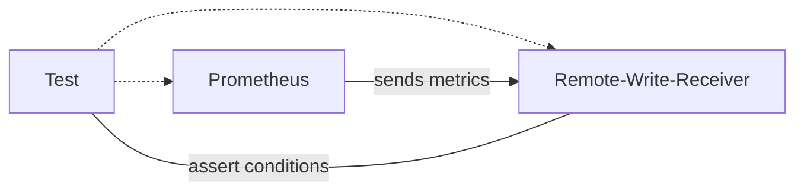

## Integration Tests
Integrations are based on the local execution of a Prometheus server and a remote-write receiver.

Each test will provide a configuration to be tested to the Prometheus server along with the endpoints to be scraped. Assertions can be implemented in the `asserter` which has access to the local remote write receiver. It also can make use of the [Prometheus API](https://prometheus.io/docs/prometheus/latest/querying/api/) to check for other things like status, targets, etc.

