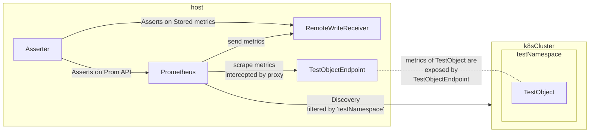

## Integration Tests
### Goal
Integration test are meant to tests some custom configurations we are adding to Prometheus with the Configurator. For instance the k8s `selector`, `target_kind`, etc. 
As an example we want to test if the relabel configs we are adding to drop some targets based on the label names in combination with annotations are behaving as expected. But we don't want to tests if `basic_auth` feature is working.

### Run

Make sure you have these tools or install them:
- [Install minikube](https://minikube.sigs.k8s.io/docs/start/)

```bash
make start-local-cluster
make integration-test
```
### Components
Integrations are based on the local execution of a Prometheus server, remote-write receiver(RWR) and local exporters. Prometheus binary is fetched/checked from the official repo by the `TestMain` function before execute tests.
K8s tests uses a real cluster (local minikube by default) to create objects to be discovered. A `.kubeconfig-dev` is required at project root for the tests/Prometheus to connect to the cluster(created by the make target).

All test are meant to be run in parallel because:
- Each test executes a RWR on a random free port.
- We use a random port for Prometheus API
- We use `kubernetes_sd_configs` namespace filtering, to isolate test objects.

New assertions can be implemented in the `asserter` which has access to the local remote write receiver and also can make use of the [Prometheus API](https://prometheus.io/docs/prometheus/latest/querying/api/) to check for other things like status, targets, etc.



